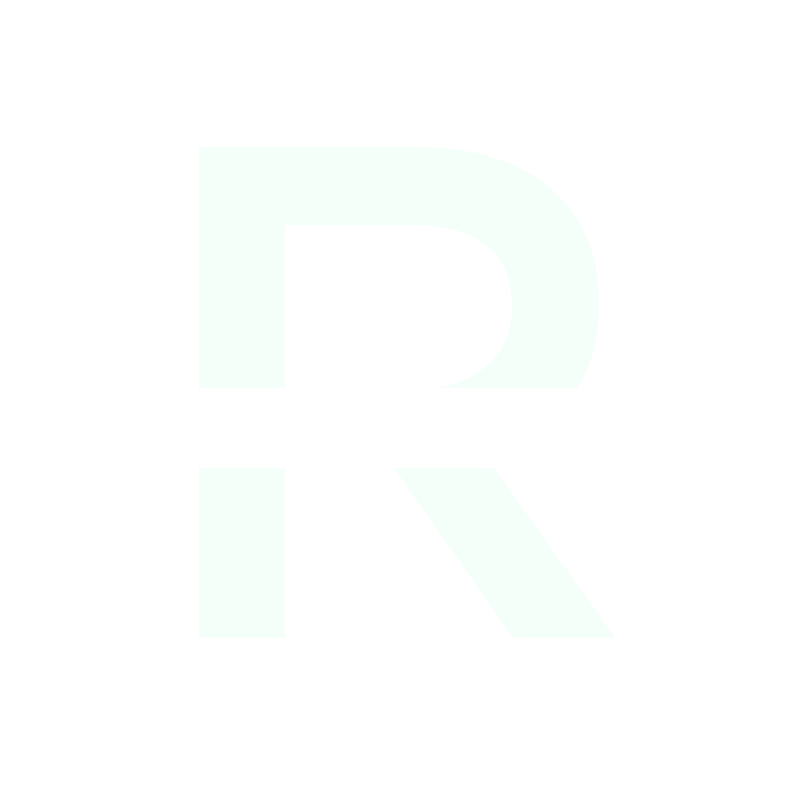

# Rodska Engine

Rodska Engine is a game/application engine that is architecturally similar to TheCherno's Hazel engine, but meant for RTS (Real-Time Strategy) and RTT (Real-Time Tactical) games. It was made in response to issues with other engines.

## Features

1. 3D Mesh support
2. ECS (via EnTT)
3. Editor (via Dear imgui)
